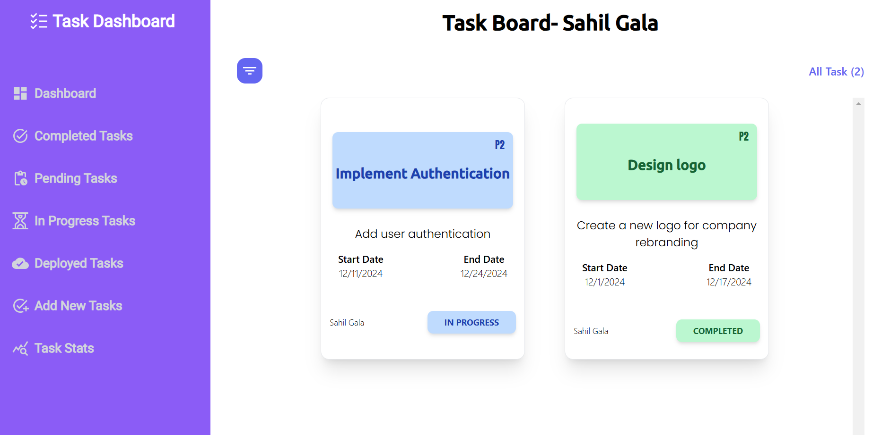
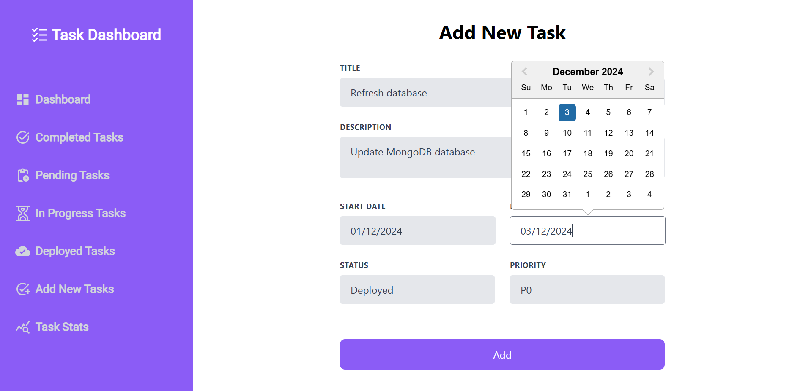
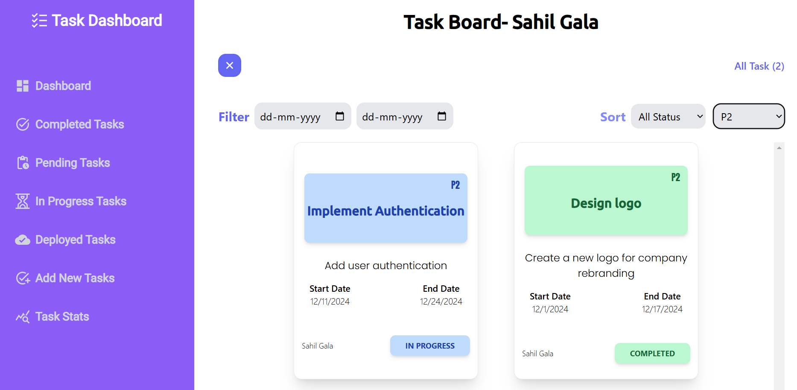

<a name="readme-top"></a>


<br />
<div align="center">
  
  
  
<h3 align="center">
Task Management Website</h3>
  
</div>

 ## All Features 🌟 

 ### 1. Redux Toolkit for Task State Management
 
#### All Tasks
 
 
 - To change the status of a task to "Complete" and update its date to the date when it was completed.
 

### 2. Add Task
  ### Add a new Task
  

   

- We can add or remove Tasks.

    ### Filter Tasks

   

-  Allows users to easily filter tasks by date, status, and priority, providing a streamlined and efficient task management experience.


## Getting Started 🚀


### Prerequisites
Before you begin contributing to this project, make sure you have the following set up:

- [Node.js](https://nodejs.org/): A JavaScript runtime.
- [npm](https://www.npmjs.com/): The Node.js package manager.

### Run This ⌨️

1. **Clone the Repository:**
   ```bash
   git clone https://github.com/Puskar-Roy/Task-Management-Web
   ```
2. **Install Dependencies:**
   ```bash
    npm install
   ```
3. **Run This Project:**
   ```bash
   npm run dev
   ```

   <p align="right">(<a href="#readme-top">back to top</a>)</p>


### Built With

This section highlights the key frameworks and libraries that form the foundation of your project. Below are some notable examples:


- **[](https://www.typescriptlang.org/):** A superset of JavaScript that adds static types.
- **[](https://developer.mozilla.org/en-US/docs/Web/JavaScript):** The programming language of 
- **[](https://www.mongodb.com/):** The database for modern applications.
- **[](https://vercel.com/):** Cloud platform for serverless deployment and hosting.
- **[](https://eslint.org/):** Pluggable linting utility for identifying and fixing code issues.
- **[](https://prettier.io/):** Opinionated code formatter to ensure consistent code styling the web.


<p align="right">(<a href="#readme-top">back to top</a>)</p>


### Sahil Gala🖋️


